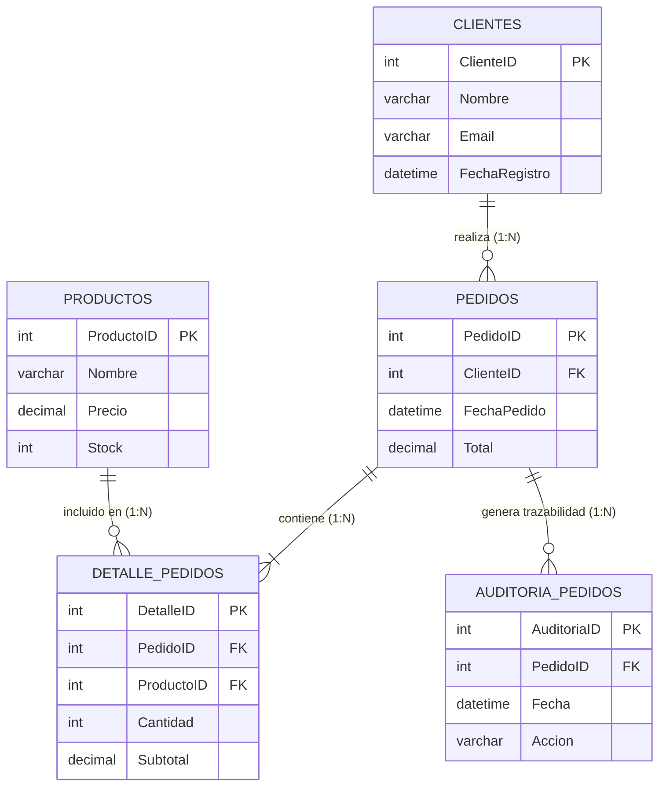

# 🛒 Order & Stock Management Database (Sistema de Gestión de Pedidos y Stocks)

[](https://www.microsoft.com/sql-server)
[](https://learn.microsoft.com/sql/t-sql/)
[](https://en.wikipedia.org/wiki/Third_normal_form)
[](https://en.wikipedia.org/wiki/ACID)
[](https://learn.microsoft.com/sql/t-sql/statements/create-trigger-transact-sql)

Sistema de base de datos relacional de alto rendimiento diseñado en **Microsoft SQL Server** para administrar de forma íntegra el ciclo de vida de compras, inventario y relaciones comerciales: **catálogo de clientes, stock de productos, órdenes de compra transaccionales, auditoría inalterable y analítica de ventas**.

Implementado bajo **Tercera Forma Normal (3NF)** con índices de optimización, procedimientos almacenados transaccionales con control de excepciones (`TRY...CATCH`), disparadores de auditoría y vistas optimizadas para reporting en tiempo real.

---

## 📸 Galería y Evidencia de Implementación

### 1. Modelado de Datos y Normalización 3NF
> Estructuración de tablas maestras con constraints de unicidad, tipos optimizados y claves foráneas.


---

### 2. Integridad Referencial y Relaciones entre Entidades
> Validación estricta de cardinalidad y reglas de cascada para preservar la consistencia de inventario.


---

### 3. Transacciones ACID y Control Concurrente de Stock
> Ejecución de órdenes con actualización atómica de inventario y rollback ante excepciones.


---

## 🏗️ Diagrama Entidad-Relación (Mermaid ER)



---

## 📦 Estructura del Repositorio y Módulos T-SQL

### 📁 `01-MODELO/` — Definición de Estructura Relacional (DDL)
* `01_CREACION_DB.sql`: Inicialización del motor y espacio de nombres de la base de datos `GestionPedidosDB`.
* `02_TABLAS.sql`: Declaración de tablas maestras con constraints (`PRIMARY KEY`, `NOT NULL`, defaults).
* `03_RELACIONES.sql`: Establecimiento de llaves foráneas (`FOREIGN KEY`) para preservar la integridad referencial.
* `04_INDICES.sql`: Índices no agrupados (`NON-CLUSTERED INDEX`) en columnas de filtrado frecuente (`ClienteID`, `FechaPedido`) para optimizar tiempos de consulta.

---

### 📁 `02-OBJETOS_TSQL_FUNCIONES/` — Programabilidad y Vistas
* **Funciones Definidas por el Usuario (UDFs):**
  * `fn_CalcularSubtotal`: Cálculo escalar de `Cantidad * Precio` con precisión decimal.
  * `fn_ContarPedidosCliente`: Retorna el volumen histórico de compras de un cliente para segmentación comercial.
* **Procedimientos Almacenados (Stored Procedures):**
  * `sp_InsertarPedido`: Registro seguro de cabecera y detalles en una sola operación.
  * `sp_ActualizarStock`: Verificación y descuento preventivo de inventario.
  * `sp_ReporteVentas`: Agregación de ventas por rangos temporales y métricas de volumen.
* **Vistas Analíticas (Views):**
  * `vw_PedidosCliente`: Consolidado legible de compras con datos desnormalizados de clientes.
  * `vw_ProductosMasVendidos`: Ranking dinámico de productos por demanda acumulada.

---

### 📁 `03-TRANSACCIONES_TSQL/` — Integridad ACID y Manejo de Errores
* `01_TransaccionesBasicas.sql`: Bloques `BEGIN TRANSACTION` / `COMMIT` para operaciones indivisibles.
* `02_TransaccionConError.sql`: Demostración de control con `BEGIN TRY...BEGIN CATCH` y `ROLLBACK TRANSACTION` automático.
* `03_ActualizacionMasiva.sql`: Ajustes de tarifas e inventario en bloque con protección de transacciones.
* `06_ErrorHandling_TSQL.sql`: Manejo de números de error, severidades y mensajes tipados con `ERROR_MESSAGE()`.

---

### 📁 `04_Triggers_Auditoria/` — Automatización y Trazabilidad
* `01_Trigger_InsertPedido.sql`: Disparador `AFTER INSERT` que alimenta la tabla `AuditoriaPedidos` de forma desatendida.
* `02_Trigger_UpdateStock.sql`: Automatización de descuento de unidades físicas tras confirmar cada línea de detalle.
* `03_Trigger_DeletePedido.sql`: Registro de eliminaciones y auditoría forense de pedidos cancelados.
* `04_PruebaTriggers.sql`: Batería de pruebas que verifica la ejecución de disparadores y la coherencia del stock.

---

## 🚀 Guía de Instalación y Ejecución en SQL Server

### Prerrequisitos
* **Microsoft SQL Server 2019+** (o SQL Server Express / LocalDB).
* **SQL Server Management Studio (SSMS)** o **Azure Data Studio**.

### Orden de Ejecución de Scripts:
```sql
-- 1. Modelo de Datos
01-MODELO/01_CREACION_DB.sql
01-MODELO/02_TABLAS.sql
01-MODELO/03_RELACIONES.sql
01-MODELO/04_INDICES.sql

-- 2. Programabilidad y Reportes
02-OBJETOS_TSQL_FUNCIONES/fn_CalcularSubtotal.sql
02-OBJETOS_TSQL_FUNCIONES/fn_ContarPedidosCliente.sql
02-OBJETOS_TSQL_FUNCIONES/sp_ActualizarStock.sql
02-OBJETOS_TSQL_FUNCIONES/sp_InsertarPedido.sql
02-OBJETOS_TSQL_FUNCIONES/sp_ReporteVentas.sql
02-OBJETOS_TSQL_FUNCIONES/vw_PedidosCliente.sql
02-OBJETOS_TSQL_FUNCIONES/vw_ProductosMasVendidos.sql

-- 3. Transacciones y Triggers
03-TRANSACCIONES_TSQL/01_TransaccionesBasicas.sql
04_Triggers_Auditoria/01_Trigger_InsertPedido.sql
04_Triggers_Auditoria/02_Trigger_UpdateStock.sql
04_Triggers_Auditoria/03_Trigger_DeletePedido.sql
```

---

## 👨‍💻 Autor y Contacto

**Luis Malagón (LMDev024)**  
*Desarrollador de Software Full Stack | Especialista en Bases de Datos Relacionales, SQL Server & .NET*

* **GitHub:** [@LMDev024](https://github.com/LMDev024)
* **Repositorio:** [GestionPedidosDB](https://github.com/LMDev024/GestionPedidosDB)
* **Portafolio Web:** [Ver Caso de Estudio en mi Portafolio](https://portfolio-project-frontend-one.vercel.app/)
